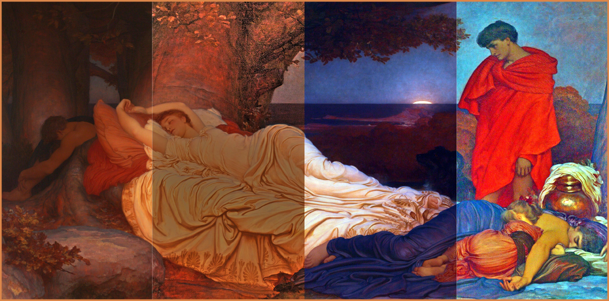
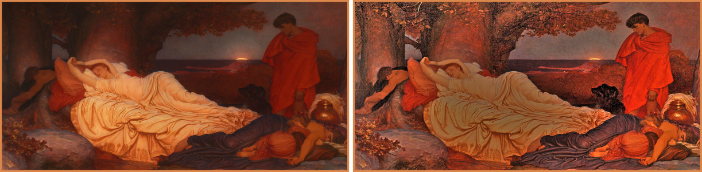
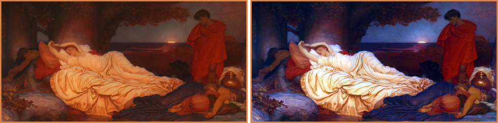
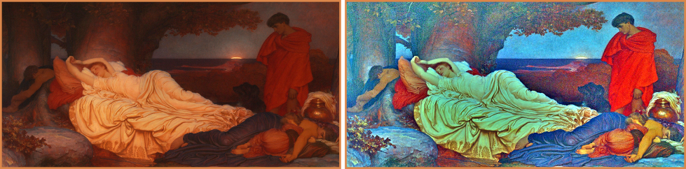
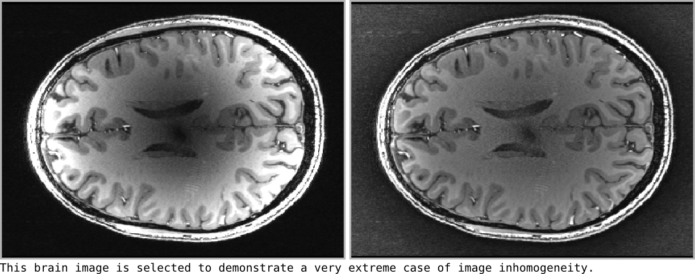

[](https://zenodo.org/badge/latestdoi/76043117)
[](https://badge.fury.io/py/iphigen)
[](http://hits.dwyl.io/ofgulban/compoda)

# Iphigen (work in progress)

A simple command-line interface for image enhancement and color balancing.

This application is being developed mainly to play with a few algorithms that I like. I am aiming at making the implementations work for 2D, 3D and 4D images. Currently implemented algorithms are:
- __Multi-scale retinex__ [1, 3]
- __Simplest color balance__ [2]
- __Simplex color balance__ (based on [3, 4], not published)



# Getting started

## Dependencies

**[Python 3](https://www.python.org/)** and the following packages:

| Package                               | Tested version |
|---------------------------------------|----------------|
| [OpenCV](https://opencv.org/)         | 3.4.4          |
| [SciPy](https://www.scipy.org/)       | 1.2.0          |
| [NiBabel](http://nipy.org/nibabel/)   | 2.2.1          |
| [NumPy](http://www.numpy.org/)        | 1.15.4         |

## Installation

Clone this repository or download the latest release. In your command line, change directory to folder of this package and run the following:
```
python setup.py install
```
If everything went fine, typing ```iphigen -h``` or ```iphigen_nifti -h``` in the command-line should show the help menu now.

## Usage
### Retinex with intensity balance
```
iphigen /path/to/image.png --retinex --intensity_balance
```


### Color balance
```
iphigen /path/to/image.png --simplest_color_balance
```


### Retinex with simplest color balance
```
iphigen /path/to/image.png --retinex --simplest_color_balance
```


## Use with Nifti files

```
iphigen_nifti /path/to/data.nii.gz --retinex
```



## Use within python scripts

See script examples [here](script_examples/).

# Support

Please use [github issues](https://github.com/ofgulban/iphigen/issues) to report bugs or make suggestions.

# License

The project is licensed under [BSD-3-Clause](https://opensource.org/licenses/BSD-3-Clause).

# References

This application is based on the following work:

1.  Jobson, D. J., Rahman, Z. U., & Woodell, G. A. (1997). _A multiscale retinex for bridging the gap between color images and the human observation of scenes._ IEEE Transactions on Image Processing, 6(7), 965–976. <http://doi.org/10.1109/83.597272>

2.  Limare, N., Lisani, J., Morel, J., Petro, A. B., & Sbert, C. (2011). _Simplest Color Balance_. Image Processing On Line, 1(1), 125–133. <http://doi.org/10.5201/ipol.2011.llmps-scb>

3.  Petro, A. B., Sbert, C., & Morel, J. (2014). _Multiscale Retinex_. Image Processing On Line, 4, 71–88. <http://doi.org/10.5201/ipol.2014.107>

4.  Gulban, O. F. (2018). _The Relation between Color Spaces and Compositional Data Analysis Demonstrated with Magnetic Resonance Image Processing Applications._ Austrian Journal of Statistics, 47(5), 34–46. <http://doi.org/10.17713/ajs.v47i5.743>
